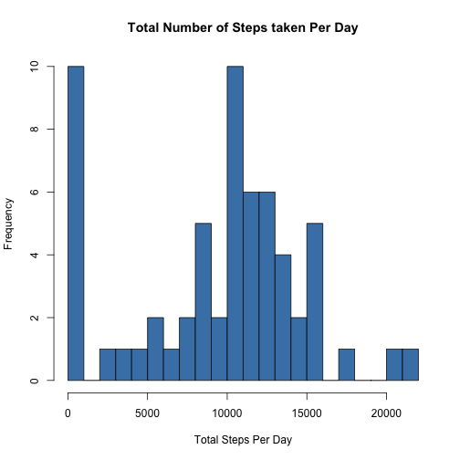
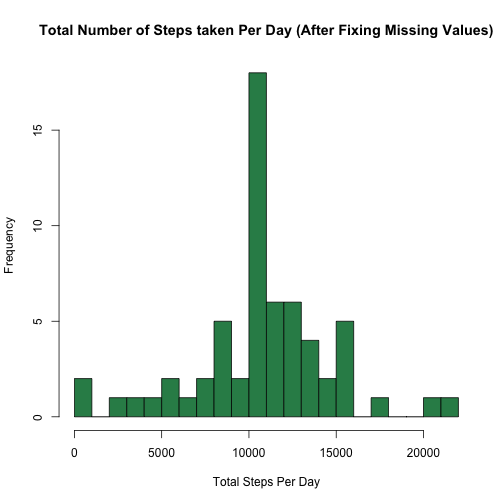
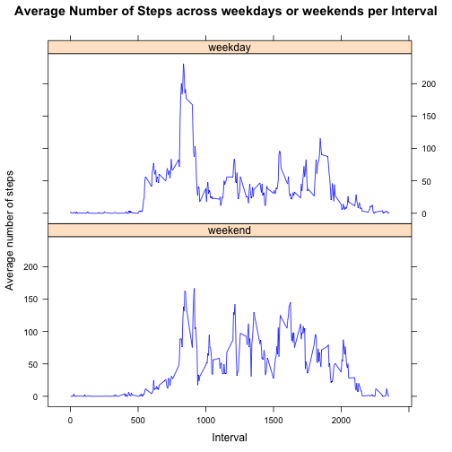

## Loading and preprocessing the data

Here, we will first unzip the files and load the contents of the file using "read.csv".


```r
unzip("activity.zip", overwrite=TRUE)
activity <- read.csv("activity.csv")
```


## What is mean total number of steps taken per day?

We will use functions from "dplyr" package to answer this question.  
We will ignore the missing values in the dataset.

**Steps:**  

1. **Calculate the total number of steps taken per day:**   
We will first group the dataset by date and then summarize it to calculate total number of steps per day.


```r
library(dplyr)
dateGroup <- group_by(activity, date)
stepsTotalPerDay <- summarize(dateGroup, totSteps = sum(steps, na.rm=TRUE))
```

2. **Make a histogram of the total number of steps taken each day:**  
We will use the "hist" function from basic plotting system


```r
hist(stepsTotalPerDay$totSteps, col="steelblue", main = "Total Number of Steps taken Per Day", xlab = "Total Steps Per Day")
```

 
 
3. **Calculate and report the mean and median of the total number of steps taken per day:**


```r
meanSteps <- round(mean(stepsTotalPerDay$totSteps, na.rm=TRUE), digits=2)
medianSteps <- median(stepsTotalPerDay$totSteps, na.rm=TRUE)
```

The mean of the total steps taken per day is **9354.23**.  

The median of the total steps taken per day is **10395**. 

## What is the average daily activity pattern?

Here are the steps we take to answer the question

**Steps:**

1. **Calculate the average number of steps taken, averaged across all days for each 5-minute interval.**
We will group the data by the 5-minute interval and then summarize it to calculate average number of steps across all days per 5-minute interval.


```r
intervalGroup <- group_by(activity, interval)
stepsAvgPerInterval <- summarize(intervalGroup, avgSteps = mean(steps,na.rm=TRUE))
```


2. **Make a time series plot (i.e. type = "l") of the 5-minute interval (x-axis) and the average number of steps taken, averaged across all days (y-axis)**


```r
with(data=stepsAvgPerInterval, plot(interval, avgSteps, type="l", main="Average Steps across all days for each interval", xlab="Interval", ylab="Average Steps", col="Blue"))
```

 

3. **Calculate the 5-minute interval, on average across all the days in the dataset, that contains the maximum number of steps**

We will calulate the maximum value of "avg steps" in the grouped data and then find the interval corresponding to that value.


```r
maxValue <- max(stepsAvgPerInterval$avgSteps)
maxInterval <- stepsAvgPerInterval$interval[which(stepsAvgPerInterval$avgSteps==maxValue)]
```

The 5-minute interval, on average across all the days in the dataset, that contains the maximum number of steps is **835**.

## Imputing missing values

**Steps:**

1. **Calculate and report the total number of missing values in the dataset (i.e. the total number of rows with NAs)**


```r
totNAValues <- sum(is.na(activity$steps))
```

The total number of missing values in activity dataset is: **2304**.


2. **Fill in all of the missing values in the dataset**  

The strategy used to fill the missing values is to replace the NA values by the mean of steps for that 5-minute interval across all days.  

The average steps across days per interval is calculated in response to 2nd question (Dataset Name: *stepsAvgPerInterval*). We will use these calculated values.

A new dataset is created which is equal to the original dataset but with the missing data filled in

Steps followed are:

- Merge the dataset "Activity" and "stepsAvgPerInterval" based on the "interval" column. Store output as a new dataset. This dataset will contain the average steps across days corresponding to an interval.

- Add a new column "new_steps" that calculates the new value for steps. If the original value for steps for an interval is "NA", the new steps value will be equal to the average number of steps (avergaed across all days) for that interval. Otherwise, new steps will be same as original steps value.

- Remove unnecessary columns introduced as a result of above steps.


```r
activity_new <- merge(activity, stepsAvgPerInterval, by.x="interval",by.y="interval", all=TRUE)

activity_new <- mutate(activity_new, new_steps = ifelse(is.na(steps), avgSteps, steps))

activity_new <- select(activity_new, steps = new_steps, date, interval)
```


3. **Make a histogram of the total number of steps taken each day**

Calculate total number of steps each day for the new dataset "activity_new"


```r
dateGroup_new <- group_by(activity_new, date)
stepsTotalPerDay_new <- summarize(dateGroup_new, totSteps = sum(steps, na.rm=TRUE))
```


Plot the histogram for total steps taken per day after fixing the missing values for steps.


```r
hist(stepsTotalPerDay_new$totSteps, col="seagreen", main = "Total Number of Steps taken Per Day (After Fixing Missing Values)", xlab = "Total Steps Per Day")
```

 

4. **Calculate and report the mean and median total number of steps taken per day for the new dataset**


```r
meanSteps_new <- mean(stepsTotalPerDay_new$totSteps)
medianSteps_new <- median(stepsTotalPerDay_new$totSteps)
```

The mean of the total steps taken per day (after fixing missing values) is **1.0766189 &times; 10<sup>4</sup>**.  

The median of the total steps taken per day (after fixing missing values) is **1.0766189 &times; 10<sup>4</sup>**. 

**YES**, these values differ from the estimates from the first part of the assignment.

After imputing the missing values, both Mean and median both have become little higher than the previous values. Also, the values of mean and median came out to be equal to each other after imputing missing values. These values are more closer to the center of the data now.

## Are there differences in activity patterns between weekdays and weekends?

**Steps:**

1. **Create a new factor variable (weekVal) in the dataset with two levels – “weekday” and “weekend” indicating whether a given date is a weekday or weekend day**

We will use mutate function, steps followed are:

- Convert "date" column to date type and compute the day of the week using "weekdays()" function
- Convert it to a factor variable and assign level "weekend" if the value is either "Saturday" or "Sunday" or Otherwise assign level "weekday".


```r
activity_new <- mutate(activity_new, weekVal = weekdays(as.Date(date)) ,weekVal = factor(ifelse(weekVal=="Saturday" | weekVal == "Sunday", 0, 1), labels=c("weekend", "weekday"))) 
```
2. **Make a panel plot of the 5-minute interval (x-axis) and the average number of steps taken, averaged across all weekday days or weekend days (y-axis).**

Before plotting the date, we will calculate the avergae number of steps taken, averaged across all weekday days or weekend days for every interval.

This is achieved by first grouping the data by "interval" and "weekVal" (weekday or weekend) and then summarize this data by calculating average number of steps taken.

Here is teh R code:


```r
groupIntWeek <- group_by(activity_new, interval, weekVal)
avgStepsPerIntervalWeek <- summarize(groupIntWeek, avgSteps = mean(steps))
```

We will use a panel plot containing a time series plot (i.e. type = "l").

The xyplot() function from lattice plotting system is used.

Here is the R code:


```r
library(lattice)
xyplot(avgSteps~interval | weekVal, data=avgStepsPerIntervalWeek, type="l", col="blue", layout = c(1,2), main="Average Number of Steps across weekdays or weekends per Interval", xlab="Interval", ylab="Average number of steps")
```

 

